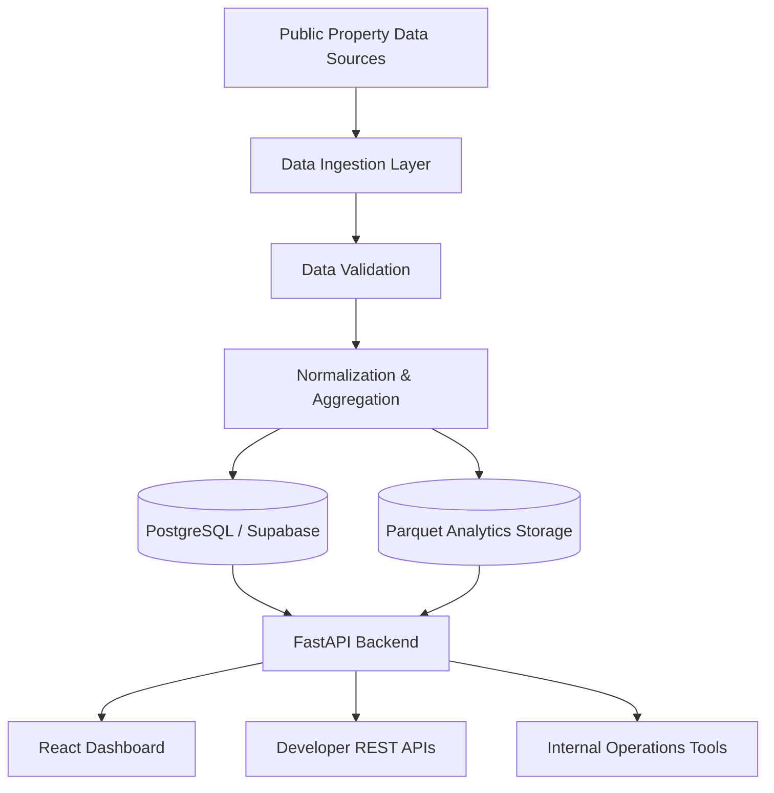

# Homara Atlas

<div align="center">


</div>

---

## 🏠 What is Homara Atlas?

Homara Atlas is a property intelligence and market analytics platform built for the Kenyan real-estate market.

The platform consolidates public property listings, rental market signals, neighbourhood metrics, affordability indicators, and historical pricing trends into a unified analytics experience for property buyers, renters, investors, agents, analysts, and developers.

Through a modern dashboard and developer-friendly APIs, Homara Atlas enables data-driven decisions across the property ecosystem.

---

## 🎯 Built For

### Home Buyers

Compare neighbourhoods, pricing trends, and affordability before purchasing property.

### Renters

Understand market rents, affordability, and area-level comparisons.

### Real-Estate Agents

Track inventory, price movements, and local market performance.

### Property Developers

Evaluate growth opportunities and market demand.

### Market Analysts

Access structured intelligence and historical housing data.

### Software Developers

Integrate property market intelligence through REST APIs.

### Internal Data Teams

Operate ingestion pipelines, analytics workflows, and market intelligence systems.

---

## ✨ Key Features

- Market overview dashboard with KPI summaries
- County and neighbourhood intelligence
- Property price index tracking
- Rental market analytics
- Affordability scoring and benchmarking
- Value-per-square-foot calculations
- Historical trend visualisations
- Geographic heatmaps
- REST APIs for developers
- Automated property data ingestion
- PostgreSQL/Supabase-ready data architecture
- AWS deployment support
- CI/CD automation

---

# 📸 Screenshots

> 🚧 Screenshots will be updated as the platform approaches public release.


## Market Overview Dashboard

docs/images/dashboard-overview.png

High-level market KPIs, county performance indicators, pricing summaries, and growth metrics.

---

## Neighbourhood Intelligence

docs/images/neighbourhood-intelligence.png

Compare neighbourhoods by affordability, average pricing, rent levels, and historical growth.

---

## Property Price Index

docs/images/price-index.png

Track market prices across counties, property types, and time periods.

---

## Rental Market Analytics

docs/images/rental-analytics.png

Analyse rent movements, rental performance, and market rental benchmarks.

---

## Affordability Analysis

docs/images/affordability-analysis.png

Understand housing affordability relative to market and income benchmarks.

---

## Geographic Heatmaps

docs/images/heatmap-analytics.png

Visualise property activity and market dynamics geographically across Kenya.

---

## Developer API Portal

docs/images/api-portal.png

Explore APIs, authentication, endpoint documentation, and example requests.

---

# 🚀 Why Homara Atlas Exists

The Kenyan real-estate market is often fragmented, difficult to compare, and lacks consistent transparency across locations.

Homara Atlas addresses this challenge by consolidating market intelligence into a single platform, helping users answer questions such as:

- Which counties are growing fastest?
- Which neighbourhoods offer the strongest value?
- How do rents compare across locations?
- What is the affordability profile of an area?
- What are current market pricing trends?
- Which locations present strong investment opportunities?

The platform provides both:

- Human-readable analytics through dashboards
- Machine-readable access through APIs

---

# 🏗 Architecture



---

# 🧩 Core Platform Components

## Frontend Dashboard

The frontend provides interactive visualisations and market analytics.

### Core Routes

| Route | Description |
|---------|-------------|
| `/` | Market Overview Dashboard |
| `/price-index` | Property Price Trends |
| `/neighbourhoods` | Neighbourhood Intelligence |
| `/affordability` | Affordability Analytics |
| `/heatmaps` | Geographic Visualisations |
| `/api-docs` | Developer Portal |

---

## Backend Analytics API

The backend is built with FastAPI and exposes versioned endpoints under:

```text
/api/v1
```

### Example Endpoints

```http
GET /api/v1/system/health
```

```http
GET /api/v1/analytics/overview
```

```http
GET /api/v1/analytics/price-index
```

```http
GET /api/v1/analytics/neighbourhoods
```

```http
POST /api/v1/ingestion/trigger/kenya-listings
```

---

# 📡 Example API Response

### Request

```http
GET /api/v1/analytics/overview
```

### Response

```json
{
  "total_properties": 52461,
  "average_sale_price": 12350000,
  "average_monthly_rent": 78500,
  "counties_covered": 47,
  "market_growth_rate": 8.3,
  "last_updated": "2026-09-15"
}
```

---

# 📊 Feature Matrix

| Area | Capabilities |
|--------|-------------|
| Market Intelligence | KPIs, trends, growth metrics |
| County Analytics | County-level market insights |
| Neighbourhood Analytics | Rankings and comparisons |
| Affordability | Affordability and value scoring |
| Price Tracking | Historical market analysis |
| Developer APIs | RESTful data access |
| Data Platform | ETL and ingestion pipelines |
| Infrastructure | Docker, AWS, Terraform |
| Security | RLS and access-control patterns |

---

# 💻 Technology Stack

## Frontend

- React 18
- TypeScript
- Vite
- Tailwind CSS
- Recharts
- Radix UI
- shadcn/ui

## Backend

- FastAPI
- Python
- Uvicorn
- Pydantic

## Data & Analytics

- Pandas
- PyArrow
- Apache Parquet
- PostgreSQL
- Supabase

## Infrastructure

- Terraform
- Docker
- Docker Compose
- AWS EC2
- AWS RDS
- AWS S3

## DevOps & Quality

- GitHub Actions
- Docker Hub
- ESLint
- Prettier
- Black
- Flake8
- Pytest

---

# 📦 Repository Structure

```text
.
├── .env.example
├── .github/
│   ├── workflows/
│   ├── ISSUE_TEMPLATE/
│   ├── CODEOWNERS
│   └── PULL_REQUEST_TEMPLATE.md
│
├── api/
│   ├── app/
│   │   ├── ingestion/
│   │   ├── routers/
│   │   ├── db.py
│   │   └── main.py
│   └── tests/
│
├── apps/
│   └── web/
│       ├── src/
│       ├── public/
│       └── package.json
│
├── database/
├── data-platform/
├── docs/
│   └── images/
│
├── infrastructure/
├── supabase/
│
├── docker-compose.prod.yml
├── README.md
├── CONTRIBUTING.md
├── SECURITY.md
├── CHANGELOG.md
└── ...
```

---

# ⚙️ Prerequisites

Before running locally ensure you have:

- Node.js
- npm
- Python 3.10+
- Git
- Docker (recommended)
- Docker Compose (recommended)
- PostgreSQL or Supabase access (optional)

---

# 🚀 Quick Start

## Clone Repository

```bash
git clone https://github.com/Mugweru01/homara-atlas.git

cd homara-atlas
```

---

## Configure Environment Variables

```bash
cp .env.example .env.local
```

### Example

```env
VITE_SUPABASE_URL=your_supabase_project_url
VITE_SUPABASE_ANON_KEY=your_supabase_anon_key
```

---

## Install Frontend Dependencies

```bash
cd apps/web

npm install
```

---

## Install Backend Dependencies

```bash
cd api

python -m venv .venv

source .venv/bin/activate

python -m pip install --upgrade pip

pip install -r requirements.txt
```

---

## Run Backend

```bash
cd api

python -m uvicorn app.main:app --reload
```

---

## Run Frontend

```bash
cd apps/web

npm run dev
```

---

# 🌐 Local URLs

### Frontend

```text
http://localhost:5173
```

### Backend API

```text
http://localhost:8000
```

### Swagger UI

```text
http://localhost:8000/docs
```

### OpenAPI Specification

```text
http://localhost:8000/openapi.json
```

---

# 🛢 Database

Database assets are located in:

```text
database/atlas_supabase_schema.sql
```

The schema includes:

- Organizations
- User Profiles
- API Keys
- Ingestion Jobs
- Access Control Policies
- Row-Level Security (RLS)

---

# 🔄 Data Pipeline

The data platform is responsible for:

1. Fetching approved public datasets
2. Validating incoming records
3. Normalising source schemas
4. Transforming analytical datasets
5. Persisting cleaned market intelligence
6. Serving analytics through APIs

### Derived Metrics Include

- Average listing price
- Average rental price
- Rent-to-price ratio
- County coverage
- Price per square foot
- Neighbourhood intelligence metrics
- Historical trend indicators

---

# ☁️ Deployment

## Docker Deployment

### Build

```bash
docker compose -f docker-compose.prod.yml build
```

### Start

```bash
docker compose -f docker-compose.prod.yml up -d
```

### Stop

```bash
docker compose -f docker-compose.prod.yml down
```

---

## AWS Infrastructure

Terraform definitions are located in:

```text
infrastructure/aws-free-tier.tf
```

Infrastructure includes:

- EC2 application server
- PostgreSQL RDS instance
- S3 data storage
- Security configuration
- Networking resources

---

# 🔄 CI/CD

GitHub Actions automate:

- Testing
- Code quality checks
- Docker builds
- Image publishing
- AWS deployments
- Environment promotion workflows

Workflow Location:

```text
.github/workflows/deploy.yml
```

---

# 🔒 Security

Recommended practices:

- Never commit secrets
- Keep service credentials server-side
- Use least-privilege access controls
- Review RLS policies regularly
- Validate and sanitise all inputs
- Rotate deployment secrets
- Keep dependencies updated

See:

```text
SECURITY.md
```

---

# 🗺 Roadmap

## Phase 1 – Core Platform ✅

- [x] React Analytics Dashboard
- [x] FastAPI Backend
- [x] Property Data Ingestion
- [x] PostgreSQL Data Platform
- [x] Docker Deployment
- [x] AWS Infrastructure

---

## Phase 2 – Market Intelligence 🚧

- [ ] Property Market Forecasting
- [ ] Rental Yield Analytics
- [ ] Market Opportunity Scoring
- [ ] Custom Alerts
- [ ] Market Watchlists
- [ ] User Saved Searches

---

## Phase 3 – Enterprise Platform 📈

- [ ] API Access Management
- [ ] Usage-Based Billing
- [ ] Multi-Tenant Organizations
- [ ] Team Workspaces
- [ ] Partner Integrations
- [ ] White-Label Deployments

---

## Phase 4 – AI & Predictions 🤖

- [ ] AI Property Insights
- [ ] Automated Valuation Models
- [ ] Investment Recommendations
- [ ] Conversational Analytics Assistant
- [ ] Predictive Market Modelling

---

# 📚 Documentation

Additional documentation:

- CONTRIBUTING.md
- SECURITY.md
- CHANGELOG.md
- DEPLOYMENT_GUIDE.md
- PRE_LAUNCH_CHECKLIST.md
- PERFORMANCE_OPTIMIZATION_GUIDE.md
- CRM_IMPLEMENTATION_DETAILED.md
- CRM_IMPLEMENTATION_SUMMARY.md
- SECURITY_AUDIT_REPORT.md

---

# 🤝 Contributing

Contributions are welcome.

Before opening a pull request:

1. Create a feature branch.
2. Implement focused changes.
3. Add or update tests.
4. Run validation checks.
5. Review security implications.
6. Submit a pull request.

For full guidelines see:

```text
CONTRIBUTING.md
```

---

# 🔍 Keywords

Kenya Real Estate • Property Intelligence • Property Analytics • Housing Data • PropTech • Market Intelligence • Real Estate Dashboard • Rental Analytics • Property API • Housing Market Insights

---

# 📄 License

Copyright © Homara.

All Rights Reserved.

---

# Summary

Homara Atlas is a modern property intelligence platform designed to make the Kenyan real-estate market more transparent, data-driven, and accessible.

Built with React, FastAPI, PostgreSQL, Supabase, Docker, Terraform, and AWS, the platform combines powerful analytics, structured APIs, market intelligence, and scalable infrastructure into a single production-ready ecosystem.
