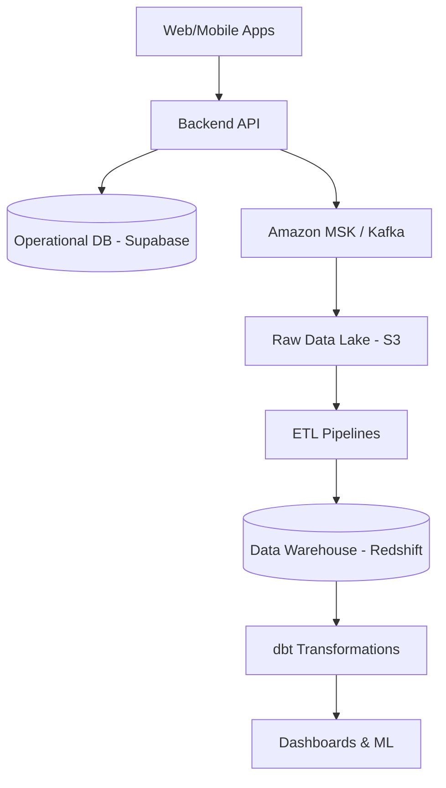

# Homara Atlas Architecture

## High-Level System Design

Homara Atlas is an event-driven Property Data Platform. All interactions within the Homara ecosystem generate events that are processed in real-time and stored for analytical workloads.

## Core Components
1. **Frontend (`/apps/web`)**: Built with React/Vite, styled with TailwindCSS, deployed to Vercel/AWS Amplify.
2. **Backend API (`/api`)**: Node.js/Bun based REST API that handles operational transactions and pushes domain events to the broker.
3. **Data Platform (`/data-platform`)**: 
   - Uses dbt for in-warehouse transformations.
   - Maintains dimensional star schemas (`dim_property`, `fact_listings`).
4. **Infrastructure (`/infrastructure`)**: Provisioned completely via Terraform, ensuring IaC validation before any deployment.

## CI/CD and Security
The repository enforces Zero Trust DevSecOps:
- Every PR undergoes SAST (CodeQL) and Secret Scanning (TruffleHog).
- Container images are scanned for vulnerabilities via Trivy.
- Terraform infrastructure is validated by `tfsec`.
