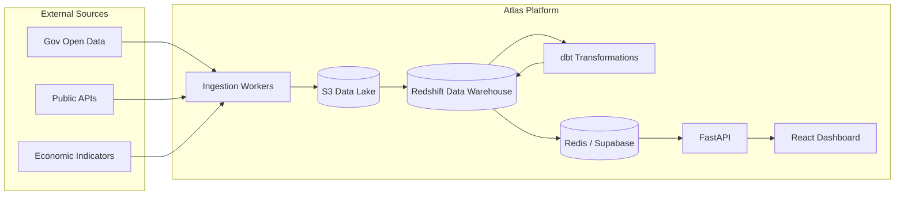

# Homara Atlas: Enterprise Architecture

The Enterprise Architecture of Homara Atlas is designed to ingest massive amounts of public, open data, transform it, and serve it as market intelligence.

## 1. Logical Architecture Layers

### Layer 1: Ingestion (EL)
Responsible for scraping public APIs, open data portals, and consuming read-only anonymized operational exports.
- **Components:** Scheduled FastAPI worker processes, Airflow DAGs.
- **Pattern:** Stateless, resilient, idempotent extraction.

### Layer 2: Raw Storage (Data Lake)
All ingested data is stored in its raw format (JSON, CSV, Parquet) immutably.
- **Components:** Amazon S3 (Object Storage).
- **Pattern:** Write-once, read-many. Data Lakehouse architecture.

### Layer 3: Streaming & Event Backbone
For real-time data sources or high-velocity metrics.
- **Components:** Amazon MSK (Managed Kafka).
- **Pattern:** Publish-Subscribe, event-driven decoupling.

### Layer 4: Data Warehouse & Transformation
The core of Atlas. Raw data is loaded into the warehouse and transformed into the Star Schema using dbt.
- **Components:** Amazon Redshift (Serverless), dbt (data build tool).
- **Pattern:** ELT (Extract, Load, Transform), Dimensional Modeling (OLAP).

### Layer 5: Application / Operational Layer
Atlas's own operational database. It manages API keys, developer subscriptions, and caching of heavy aggregate queries.
- **Components:** Supabase (PostgreSQL), Redis.

### Layer 6: Serving & Presentation
The consumer-facing APIs and dashboards.
- **Components:** FastAPI (REST/GraphQL), React/Vite (Dashboards).

## 2. Data Flow Diagram

